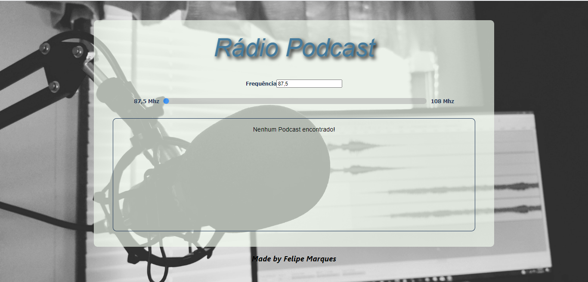

[PT-BR]

# Projeto Radio Podcast - Bootcamp IGTI

Professor: Raphael Gomide. 
Aluno: Felipe Marques.

## :memo: Status:

- Concluído.

## :dart: Objetivo:

Exercitar conceitos trabalhados no Módulo 1 do Bootcamp Dev Full Stack como:

- Declarar elementos HTML como títulos, input, div, span, ul, li etc. 
- Estilizar o app com CSS. 
- Mapear elementos do DOM para serem manipulados com JavaScript. 
- Formatar valores com JavaScript. 
- Utilizar template literals.
- Utilizar array method Find(). 

## Radio Podcast

## :octocat: Projeto:

[Deploy](https://felipe-marques.github.io/radio-podcast/)
